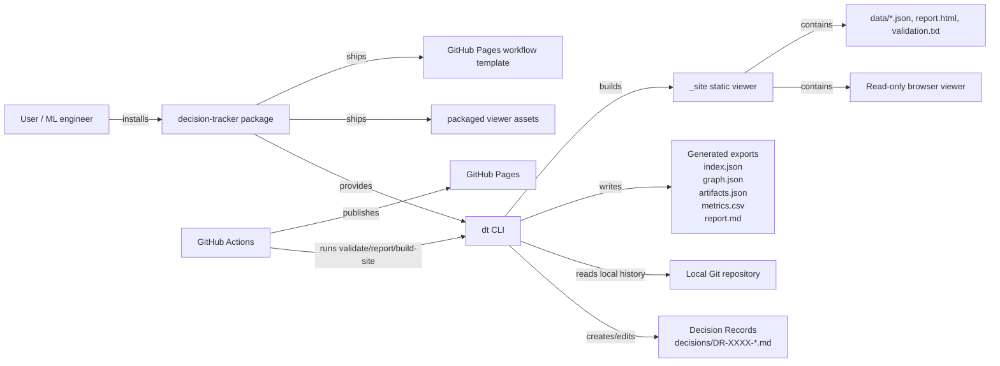
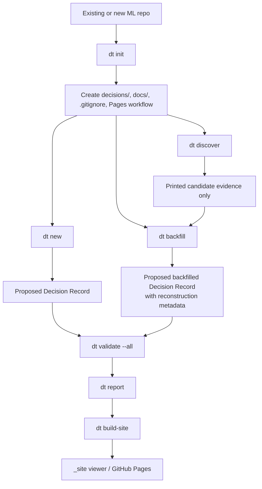
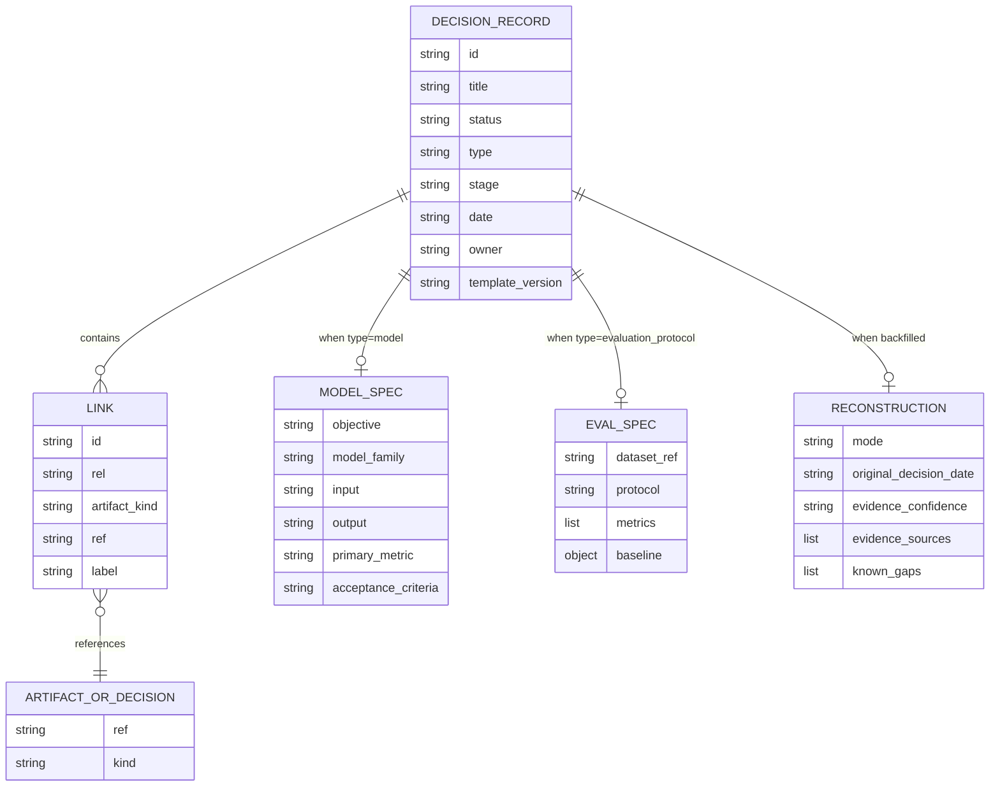
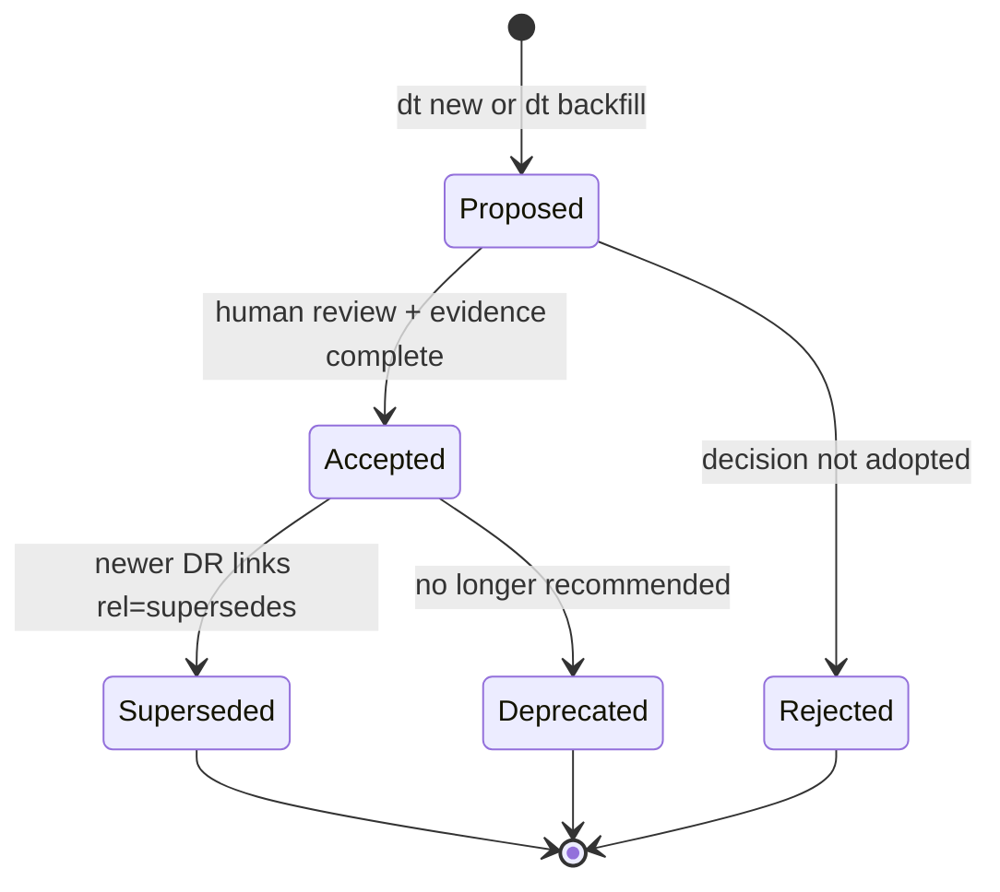
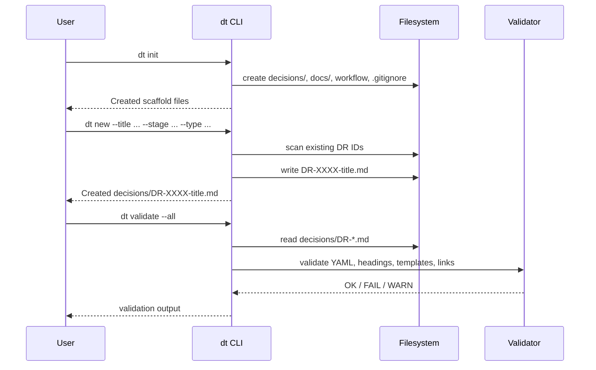
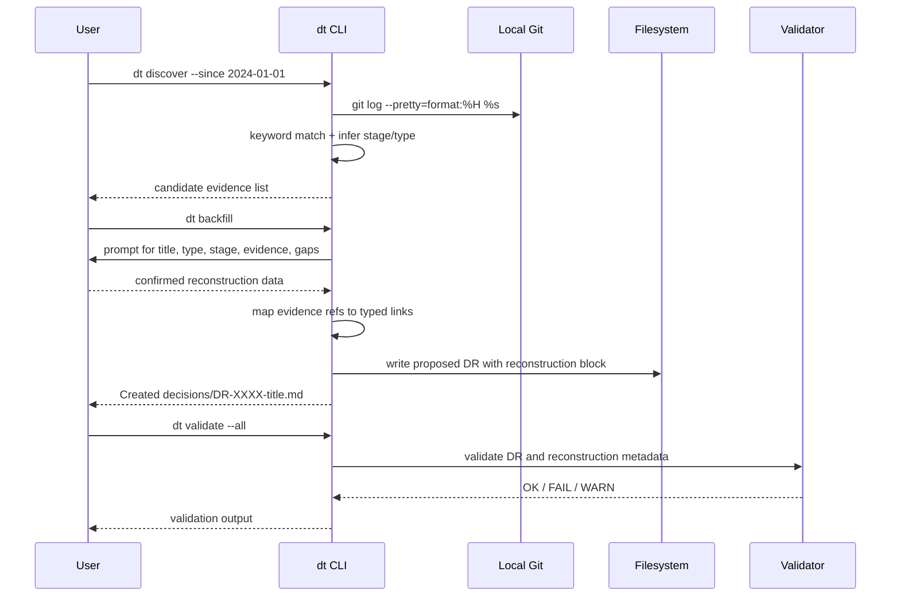
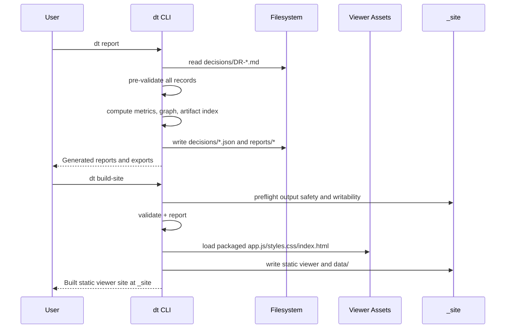
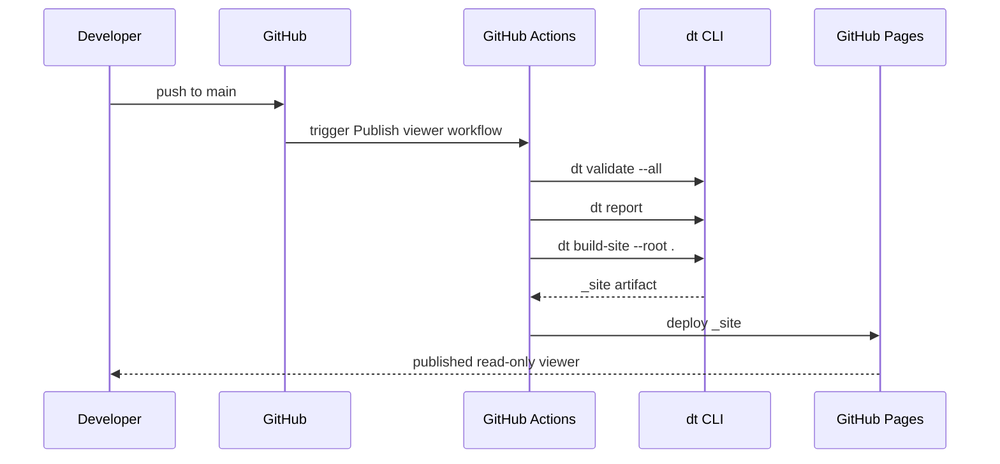
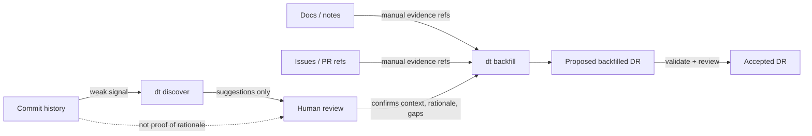
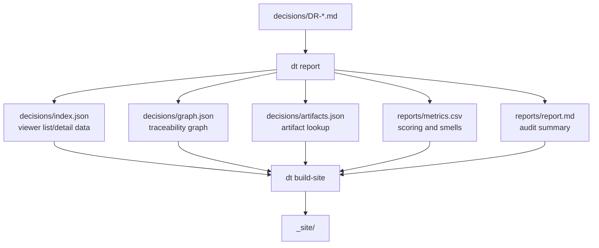

# Architecture

This file describes the current Decision Tracker architecture after adding package installation, static viewer publishing, Git-aware validation, and historical backfill support.

## Existing Diagram Review

The original diagrams still apply at a high level:

- developers write Decision Records under `decisions/`
- the `dt` CLI validates records and generates exports
- the viewer loads generated JSON artifacts

They were incomplete for the current implementation because they did not include:

- `dt init`
- `dt discover`
- `dt backfill`
- `dt build-site`
- packaged viewer/workflow assets
- GitHub Pages deployment
- reconstruction metadata for historical decisions
- Git checks for `git:commit:<sha>` references

## System Context

## Command Map

## Data Model

## Decision Lifecycle

## Forward Capture Sequence

## Historical Backfill Sequence

## Report And Viewer Build Sequence

`dt build-site` intentionally runs validation and report generation before copying viewer assets, because the published site should reflect the same validated exports as local reporting. Before those steps, it checks that the requested site output path is safe and writable. It refuses to replace the project root, ancestors of the project root, unknown non-empty directories, and symlinked output paths unless `--force` is explicitly used.

## GitHub Pages Publishing Sequence

## Backfill Trust Boundary

## Generated Artifacts

`_site/` includes a non-dot marker file named `__DT_SITE__`. The marker lets later builds recognize the directory as generated and safe to replace without publishing a hidden dotfile through GitHub Pages.
